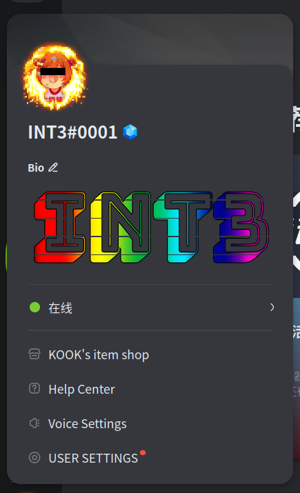

# How to Have a Fancy KOOK Bio
# 如何拥有一个华丽的KOOK自我介绍

## 效果图：

## 原理：

**Bio**中的图片其实是用自定义表情拼接而成。

只要准备 5 张宽高比为 71:5 的图片即可达到上图的效果。

为了保证清晰度，推荐尺寸为 5 张 2840x200 的图片

## 小工具

使用本仓库的 bio.py 脚本可以方便地将图片裁成纵向五等分

只需准备 2840x1000 的图片一张

运行`python bio.py <输入图片路径> <生成图片路径>`即可自动生成所需的 5 张目标图片

